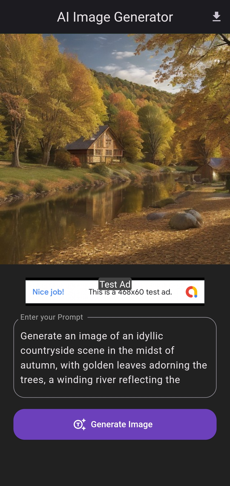

# Text-to-Image Generator Flutter App

This Flutter app generates images from text using an external API and integrates Google Ads. The app allows users to download the generated images. The app uses the DeepAI Text2Img API, which is a paid service but offers limited free testing.

## Features

- **Generate Images from Text:** Users can input text prompts and generate images based on them.
- **Download Images:** Generated images can be downloaded directly from the app.
- **Google Ads Integration:** Monetize the app with Google Ads.
- **In Progress:** The app is continuously being improved with new features. Some upcoming features include:
  - Customization options for generated images (e.g., font styles, colors).
  - Image filtering and editing tools.
  - Social media sharing capabilities.
  - Integration with additional APIs for enhanced image generation.
 

This project is a simple yet powerful demonstration of generating images from text prompts using the DeepAI API and integrating Google Ads in a Flutter app.

## Screenshots

|                         |                         |
|-------------------------|-------------------------|
|  |  |
|  |  |


## Installation

To install and run the app, follow these steps:

1. **Clone the repository:**
    ```bash
    git clone https://github.com/Vishnu-Deepan/ai-image-generator.git
    cd ai-image-generator
    ```

2. **Install dependencies:**
    ```bash
    flutter pub get
    ```

3. **Set up API keys:**
    - Open `lib/config.dart` and set your API key for DeepAI Text2Img API.
    - Example:
      ```dart
      const String bearerKey = 'your_deepai_api_key';
      ```

4. **Run the app:**
    ```bash
    flutter run
    ```

## Contact

For any questions or suggestions, feel free to contact me at [vishnudeepan@example.com].

---
